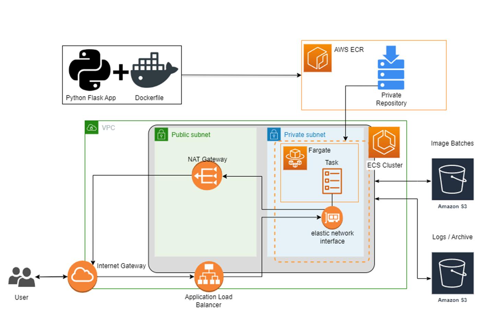

# From Model to Production
Deploying a Image Classification Model with Docker, Flask and Terraform as Infrastructure as a Code (IaC) on Amazon Web Services (AWS) for the **From Model to Production** course of my studies at the International University.

# Local / Cloud
The application for local computing:
```
/local
```

The application for the cloud, incl. Terraform code to create infrastructure on AWS:
```
/cloud
```


## Run Locally
You can run the application locally, making sure the following prerequieries:

1. **Docker Engine** <br /> 
You will need Docker Desktop to run on your PC. For download and documentation, please check the [official website](https://www.docker.com/). Make sure Docker is running when apply the IaC to AWS. <br />
You may also need to register on [Docker Hub](https://hub.docker.com/).

2. **Build Image** <br />
```
docker build -t yourtag .
```
3. **Run Container** <br />
```
 docker run -d -p 5000:5000 yourtag
```

## Deploy on Cloud
Before you can deploy the infrastructure on the cloud with terraform, your computer must meet the following requirements:

1. **Linux Distribution // Windows Subsystem for Linux (WSL)** <br /> 
First, make sure you have a Linux Distribution to run the IaC template. If you're working with Windows, check the [Documentation on WSL](https://learn.microsoft.com/en-us/windows/wsl/) to set up a WSL.

2. **AWS Account** <br /> 
You will have to create an account at AWS to use this template. For further information, please visit the [official AWS website](https://aws.amazon.com/).
Make sure to also **download the AWS Command Line Interface (AWS CLI)** and **create an user in the Identity and Access Management (IAM)** with administrative access.

3. **Terraform** <br /> 
Next, you need to make sure Terraform runs on your PC. For downloading and setting up the tool please visit the [official website](https://www.terraform.io/).

4. **Docker Engine** <br /> 
Last, you will need Docker Desktop to run on your PC. For download and documentation, please check the [official website](https://www.docker.com/). Make sure Docker is running when apply the IaC to AWS. <br />
You may also need to register on [Docker Hub](https://hub.docker.com/).

After following the above mentioned steps, you're good to go and run the terraform script.

You can get the code by either downloading the .zip-File or clone it via the command promt. For more information about the later please check the [github docs](https://docs.github.com/en/repositories/creating-and-managing-repositories/cloning-a-repository).


### Deployment

First, you will have to enter your **AWS credentials** in the files
```
**/application/cron-script.sh**
export AWS_ACCESS_KEY_ID="youraccesskey"
export AWS_SECRET_ACCESS_KEY="yoursecretkey"

**/application/.env**
AWS_ACCESS_KEY=youraccesskey
AWS_SECRET_KEY=yoursecretkey
```
(had issues with importing the credentials in the shell script, if you have any solutions for this, I'm happy to hear)

Before you can upload your infrastructure to AWS, you'll need to login in the console with
```
aws configure
```
Insert your AWS Access Key ID and AWS Secret Access Key. 
Make sure Docker Desktop is running.

Then run the following commands in the *infrastructure* directory:
```
terraform init
```

If you want to see before hand what will be deployed, use the following command: 
```
terraform plan -var-file="variables.tfvars"
```

To apply the infrastructure to AWS, use the following command:
```
terraform apply -var-file="variables.tfvars"
```

To destroy the infrastructure to AWS, use the following command:
```
terraform destroy -var-file="variables.tfvars"
```

## The Machine Learning Application

The ML-aplication is done with tensorflow, with use of the Fashion MNIST Dataset.


## Graphical Representation of the Infrastructure 

The infrastructure after applying it to AWS will be like the following: <br /> 



## Tested OS
The infrastructure was successfully tested with 
* Windows 11 Home with Debian for Windows Subsystem for Linux (WSL)
* Fedora Linux 37 (Workstation Edition)

### Troubleshooting
#### Setup of Docker Desktop in Linux:
On Linux, you may run into some errors while setup the environment for Docker. What worked best for me is 
* Changing the owner of the file /var/run/docker.sock (root access required).
* Generate a gpg key on [Docker Hub](https://hub.docker.com/).
* If you still run into an error, try the following commands: 
``` 
service docker stop
rm ~/.docker/config.json
service docker start 
```

#### Permission error on *build.sh* in Linux
You may get a permission error on the *build.sh* file on Linux, you can solve this with making the file executable:
```
chmod u+x build.sh
```


#### Pushing Docker image to AWS
You may get an error message when Docker Engine is not running: <br />

**Windows:**
```
null_resource.build_and_push (local-exec): The command 'docker' could not be found in this WSL 2 distro.
```
Please make sure to run the commands in the **WSL if using Windows**, otherwise the Docker Container won't get build automatically! (You'll get a Error Message on "local-exec" when applying with Terraform).


**Linux:**
```
null_resource.build_and_push (local-exec): Cannot connect to the Docker daemon at unix:///var/run/docker.sock. Is the docker daemon running?
```
In that case, simply start the Docker Desktop application. <br />
For Linux, you additionaly may need to remove the file */var/run/docker.sock*.
